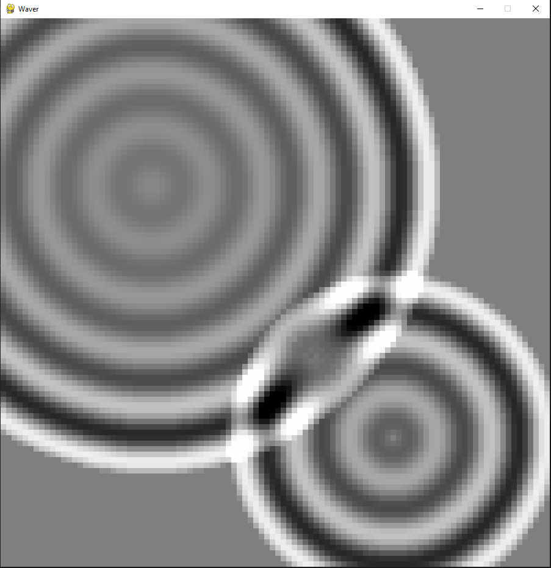

# Waver

Wave simulator on pygame-ce.

## Description

Simple app that simulates longitudinal waves on a flat surface. It works by creating centers from where the wave originates and updating every cell on the board. The wave is then translated to a black and white gradient that gives the idea of the wave. The centers are storage in a list with a time indicator of when it was activated. This center's list is used by the cells to update its z coordinate. 

The app takes advantage of the nature of waves. Since waves are basically a repeating pattern for each particle, and its position (z coordinate in this app) is defined by the time elapsed since the wave is triggered, the only variable necessary in each cell is the difference between the center's activation and the actual time. The cell is activated when the wave reaches it (define by the wave speed), which in the app is simulated by adding the center to a list of affecting centers. The overlapping between waves is calculated by adding the individual effects of each center over the cell.

## Using Waver

### Dependencies

* pygame-ce
* math library

### Executing program

Upon running wave.py a grey board will appear. To generate a wave click on the dessire spot. Clicking several times will generate waves emmanating from each clicked cell.

Running app with two active waves overlapping

## Known issues
As the waves are amortiguated but never get extint the app will acumulate almost inactive waves on the long run

## Author:

Leonardo Mario Mazzeo
leomazzeo@gmail.com

